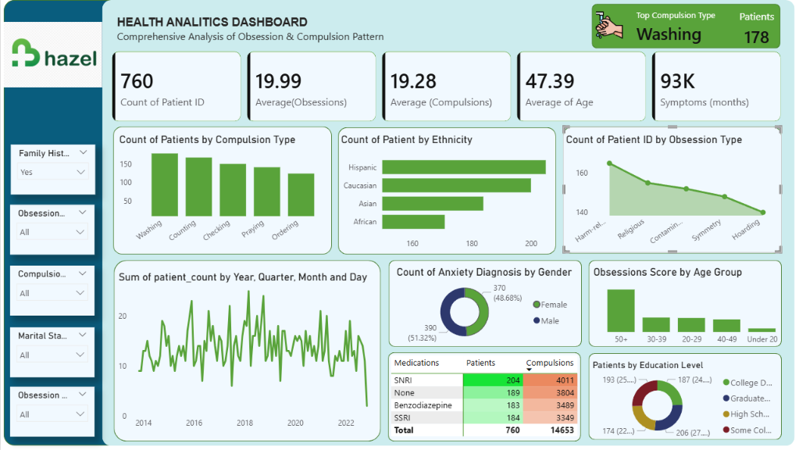

# 🏥 Healthcare Analytics Dashboard | OCD Patient Analysis

## 📌 Project Overview

This project is an interactive **Healthcare Analytics Dashboard** developed using **Power BI** and **MySQL** to analyze an OCD (Obsessive-Compulsive Disorder) patient dataset. The dashboard transforms raw healthcare data into meaningful insights that support data-driven decision-making through interactive visualizations and KPIs.

---

## 📊 Dashboard Preview

> **Dashboard Screenshot**

---

## 🎯 Project Objectives

* Analyze OCD patient demographics.
* Identify the most common obsession and compulsion types.
* Monitor OCD diagnosis trends over time.
* Compare obsession and compulsion severity scores.
* Explore ethnicity, education level, and anxiety diagnosis distributions.
* Build an interactive dashboard using Power BI.

---

## 🛠 Tools & Technologies

* **Power BI**
* **MySQL**
* **DAX**
* **Power Query**
* **Microsoft Excel**

---

## 📂 Dataset Information

The dataset contains healthcare records with the following fields:

* Patient ID
* Age
* Gender
* Ethnicity
* Marital Status
* Education Level
* OCD Diagnosis Date
* Duration of Symptoms (Months)
* Previous Diagnoses
* Family History of OCD
* Obsession Type
* Compulsion Type
* Y-BOCS Score (Obsessions)
* Y-BOCS Score (Compulsions)
* Depression Diagnosis
* Anxiety Diagnosis
* Medications

---

## 📈 Dashboard Features

### KPI Cards

* Total Patients
* Average Obsession Score
* Average Compulsion Score
* Average Age
* Average Symptom Duration
* Most Common Compulsion Type

---

### Interactive Visualizations

* Patients by Compulsion Type
* Patients by Obsession Type
* Ethnicity Distribution
* OCD Diagnosis Trend
* Anxiety Diagnosis by Gender
* Obsession Score by Age Group
* Patients by Education Level
* Medication Analysis

---

### Interactive Filters

* Family History of OCD
* Obsession Type
* Compulsion Type
* Marital Status

---

## 📊 SQL Analysis Performed

The project includes SQL queries to answer business questions such as:

* Count and percentage of male vs. female patients, along with the average obsession score by gender.
* Patient distribution by ethnicity and the corresponding average obsession score.
* Month-over-month (MoM) trend of OCD diagnoses.
* Most common obsession types and their average obsession scores.
* Most common compulsion types and their average obsession scores.
* Patient distribution by education level.
* Patient distribution by marital status.
* Anxiety diagnosis distribution with patient percentages.
* Family history of OCD analysis with average obsession scores.
* Average obsession score by medication type.

---

## 📷 Dashboard Components

✔ KPI Cards

✔ Interactive Filters

✔ Bar Charts

✔ Line Chart

✔ Donut Chart

✔ Matrix

✔ Dynamic Visuals

---

## 🚀 Skills Demonstrated

* Data Cleaning
* SQL Query Writing
* Data Modeling
* DAX Measures
* Power BI Dashboard Design
* Healthcare Data Analysis
* KPI Development
* Interactive Reporting
* Data Visualization

## ⭐ If you found this project useful, consider giving it a Star on GitHub!
